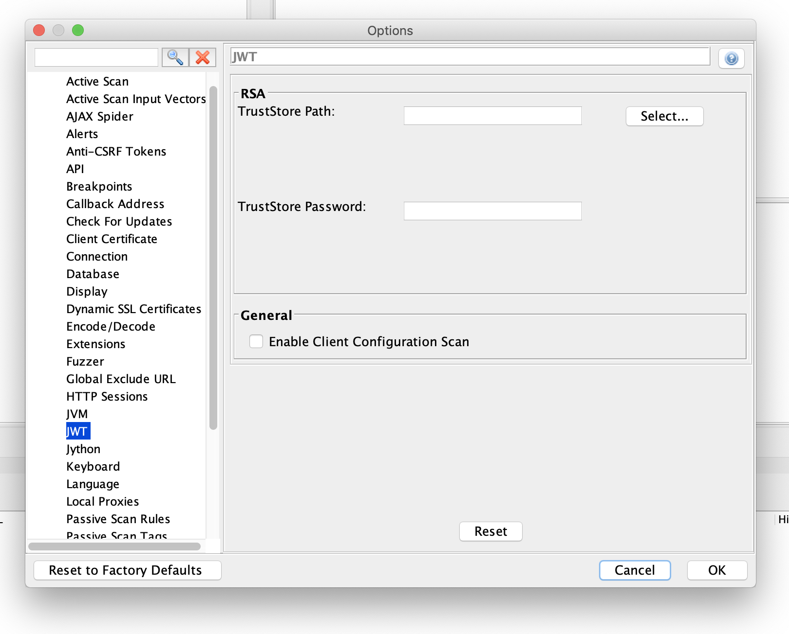

# owasp-zap-jwt-addon   

This Project contains the JWT Scanner and JWT Fuzzer addon used for finding JWT related vulnerabilities.

## Why this addon is needed
With the popularity of JSON Web Tokens there comes the need to secure them so that they are not misused because of the bad configuration or older libraries or buggy implementations. So Owasp ZAP JWT Addon is used to find such vulnerabilities and this document explains on how to use this Addon.

## Configuration
As we have added some Scanner rules related to JWT so those scanning rules runs with Active Scanner so most of the configurations are same as Active Scanner but there are certain configurations which are specific for JWT Scanner.
Under Options tab you will find JWT section as shown below:

### Explanation
In case the application which you are trying to scan is using RSA or more specifically RS* algorithm then please mention the public certificate TrustStore path and TrustStore password. These fields are used to find certain vulnerabilities related to RS* based JWT's.

Enable Client Configuration Scan flag is used to enable client side validations like JWT token is sent to the browser in an insecure way or non-recommended way.

### Vulnerabilities covered by the scanner:
JWT scanner finds vulnerability in Client/Browser as well as Server/Library side implementations.

For Client side it covers most of the vulnerabilities mentioned in [OWASP CheatSheet](https://cheatsheetseries.owasp.org/cheatsheets/JSON_Web_Token_Cheat_Sheet_for_Java.html#token-storage-on-client-side)

For Server side it mainly covers following vulnerabilities:
1. [None Algorithm attack](https://auth0.com/blog/critical-vulnerabilities-in-json-web-token-libraries/#Meet-the--None--Algorithm)
2. [Algorithm Confusion attack](https://auth0.com/blog/critical-vulnerabilities-in-json-web-token-libraries/#RSA-or-HMAC-)
3. [Trusting JWK key provided with the Token](https://nvd.nist.gov/vuln/detail/CVE-2018-0114)
4. Empty JWT Token
5. Null Byte Injection attack

**Note:** All the above vulnerabilities are tested against the [Owasp VulnerableApp](https://github.com/SasanLabs/VulnerableApp) please visit that for more information on the vulnerabilities. 

## Future works
Till now this addon contains only JWT Scanner for finding vulnerabilities and next we are planning to provide a JWT fuzzer and bruteforcer for JWT's.
1. JWT fuzzer will be helpful for finding vulnerabilities like SQL Injection/SSRF in JWT Field values.
2. Bruteforce attack will be helpful in finding vulnerabilities related to Secret Keys which are used for signing the tokens.

## Contributing guidelines
Contributing guidelines are same as [Zaproxy](https://github.com/zaproxy/zaproxy).

## Contact Us
For any Queries/Bugs or Enhancement please raise an issue in this repository or [Zaproxy](https://github.com/zaproxy/zaproxy).
For any other kind of issues please send an email to preetkaran20@gmail.com

